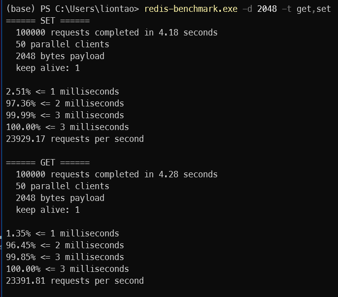

# 第八周作业

1、使用 redis benchmark 工具, 测试 10 20 50 100 200 1k 5k 字节 value 大小，redis get set 性能。  





## 程序测试

源码：[main.go](./main.go)

```bash
插入前key 1  内存使用情况:  654311424 b, 插入后key 1  内存使用情况:  3640655872 b, 插入占用内存:  2986344448 b
插入前key 2  内存使用情况:  3640655872 b, 插入后key 2  内存使用情况:  3774873600 b, 插入占用内存:  134217728 b
插入前key 3  内存使用情况:  3774873600 b, 插入后key 3  内存使用情况:  536870912 b, 插入占用内存:  0 b
插入前key 4  内存使用情况:  536870912 b, 插入后key 4  内存使用情况:  503316480 b, 插入占用内存:  0 b
插入前key 5  内存使用情况:  503316480 b, 插入后key 5  内存使用情况:  2516582400 b, 插入占用内存:  2013265920 b
插入前key 6  内存使用情况:  2516582400 b, 插入后key 6  内存使用情况:  3405774848 b, 插入占用内存:  889192448 b
插入前key 7  内存使用情况:  3405774848 b, 插入后key 7  内存使用情况:  1392508928 b, 插入占用内存:  0 b
插入前key 8  内存使用情况:  1392508928 b, 插入后key 8  内存使用情况:  1426063360 b, 插入占用内存:  33554432 b
插入前key 9  内存使用情况:  1426063360 b, 插入后key 9  内存使用情况:  2801795072 b, 插入占用内存:  1375731712 b
插入前key 10  内存使用情况:  2801795072 b, 插入后key 10  内存使用情况:  2181038080 b, 插入占用内存:  0 b
插入前key 11  内存使用情况:  2181038080 b, 插入后key 11  内存使用情况:  1778384896 b, 插入占用内存:  0 b
插入前key 12  内存使用情况:  1778384896 b, 插入后key 12  内存使用情况:  3506438144 b, 插入占用内存:  1728053248 b
插入前key 13  内存使用情况:  3506438144 b, 插入后key 13  内存使用情况:  268435456 b, 插入占用内存:  0 b
插入前key 14  内存使用情况:  268435456 b, 插入后key 14  内存使用情况:  268435456 b, 插入占用内存:  0 b
插入前key 15  内存使用情况:  268435456 b, 插入后key 15  内存使用情况:  67108864 b, 插入占用内存:  0 b
插入前key 16  内存使用情况:  67108864 b, 插入后key 16  内存使用情况:  1258291200 b, 插入占用内存:  1191182336 b
插入前key 17  内存使用情况:  1258291200 b, 插入后key 17  内存使用情况:  201326592 b, 插入占用内存:  0 b
插入前key 18  内存使用情况:  201326592 b, 插入后key 18  内存使用情况:  1392508928 b, 插入占用内存:  1191182336 b
插入前key 19  内存使用情况:  1392508928 b, 插入后key 19  内存使用情况:  1694498816 b, 插入占用内存:  301989888 b
插入前key 20  内存使用情况:  1694498816 b, 插入后key 20  内存使用情况:  3506438144 b, 插入占用内存:  1811939328 b
插入前key 21  内存使用情况:  3506438144 b, 插入后key 21  内存使用情况:  4043309056 b, 插入占用内存:  536870912 b
插入前key 22  内存使用情况:  4043309056 b, 插入后key 22  内存使用情况:  3405774848 b, 插入占用内存:  0 b
插入前key 23  内存使用情况:  3405774848 b, 插入后key 23  内存使用情况:  905969664 b, 插入占用内存:  0 b
插入前key 24  内存使用情况:  905969664 b, 插入后key 24  内存使用情况:  1358954496 b, 插入占用内存:  452984832 b
插入前key 25  内存使用情况:  1358954496 b, 插入后key 25  内存使用情况:  3623878656 b, 插入占用内存:  2264924160 b
插入前key 26  内存使用情况:  3623878656 b, 插入后key 26  内存使用情况:  2315255808 b, 插入占用内存:  0 b
插入前key 27  内存使用情况:  2315255808 b, 插入后key 27  内存使用情况:  2382364672 b, 插入占用内存:  67108864 b
插入前key 28  内存使用情况:  2382364672 b, 插入后key 28  内存使用情况:  201326592 b, 插入占用内存:  0 b
插入前key 29  内存使用情况:  201326592 b, 插入后key 29  内存使用情况:  201326592 b, 插入占用内存:  0 b
插入前key 30  内存使用情况:  201326592 b, 插入后key 30  内存使用情况:  2969567232 b, 插入占用内存:  2768240640 b
插入前key 31  内存使用情况:  2969567232 b, 插入后key 31  内存使用情况:  50331648 b, 插入占用内存:  0 b
插入前key 32  内存使用情况:  50331648 b, 插入后key 32  内存使用情况:  3288334336 b, 插入占用内存:  3238002688 b
插入前key 33  内存使用情况:  3288334336 b, 插入后key 33  内存使用情况:  33554432 b, 插入占用内存:  0 b
插入前key 34  内存使用情况:  33554432 b, 插入后key 34  内存使用情况:  3355443200 b, 插入占用内存:  3321888768 b
插入前key 35  内存使用情况:  3355443200 b, 插入后key 35  内存使用情况:  2466250752 b, 插入占用内存:  0 b
插入前key 36  内存使用情况:  2466250752 b, 插入后key 36  内存使用情况:  1996488704 b, 插入占用内存:  0 b
插入前key 37  内存使用情况:  1996488704 b, 插入后key 37  内存使用情况:  50331648 b, 插入占用内存:  0 b
插入前key 38  内存使用情况:  50331648 b, 插入后key 38  内存使用情况:  1476395008 b, 插入占用内存:  1426063360 b
插入前key 39  内存使用情况:  1476395008 b, 插入后key 39  内存使用情况:  50331648 b, 插入占用内存:  0 b
插入前key 40  内存使用情况:  50331648 b, 插入后key 40  内存使用情况:  939524096 b, 插入占用内存:  889192448 b
插入前key 41  内存使用情况:  939524096 b, 插入后key 41  内存使用情况:  3087007744 b, 插入占用内存:  2147483648 b
插入前key 42  内存使用情况:  3087007744 b, 插入后key 42  内存使用情况:  452984832 b, 插入占用内存:  0 b
插入前key 43  内存使用情况:  452984832 b, 插入后key 43  内存使用情况:  2030043136 b, 插入占用内存:  1577058304 b
插入前key 44  内存使用情况:  2030043136 b, 插入后key 44  内存使用情况:  2281701376 b, 插入占用内存:  251658240 b
插入前key 45  内存使用情况:  2281701376 b, 插入后key 45  内存使用情况:  4278190080 b, 插入占用内存:  1996488704 b
插入前key 46  内存使用情况:  4278190080 b, 插入后key 46  内存使用情况:  16777216 b, 插入占用内存:  0 b
插入前key 47  内存使用情况:  16777216 b, 插入后key 47  内存使用情况:  2097152000 b, 插入占用内存:  2080374784 b
插入前key 48  内存使用情况:  2097152000 b, 插入后key 48  内存使用情况:  3238002688 b, 插入占用内存:  1140850688 b
插入前key 49  内存使用情况:  3238002688 b, 插入后key 49  内存使用情况:  4278190080 b, 插入占用内存:  1040187392 b
插入前key 50  内存使用情况:  4278190080 b, 插入后key 50  内存使用情况:  1040187392 b, 插入占用内存:  0 b

50个key平均占用内存  4026 k
```
